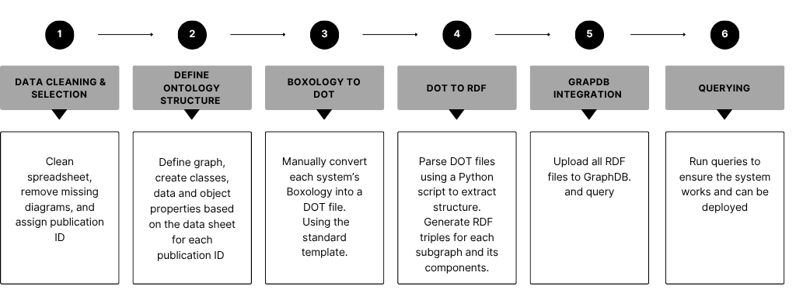

# MedAI_ArchitectureKG

This repository contains the code and data developed as part of the methodology for the bachelor thesis project titled "Formalizing Boxology: An Ontology-Driven Approach for Representing Neuro-Symbolic Medical AI Architectures." The project aims to convert unstructured diagrams of medical AI systems into structured, machine-readable knowledge graphs using semantic web technologies.

## Repository Structure
- Phase1_DataCleaning.ipynb: Jupyter Notebook for cleaning and preprocessing raw data extracted from publications.
- Phase2_OntologyCreation.py: Python script to define and create the ontology framework representing AI system components and their relationships.
- Phase3_Boxology_DOT: Directory containing DOT files representing Boxology diagrams of AI systems.
- Phase3_Boxology_RDF: Directory containing RDF files converted from DOT representations.
- Phase4_ParsingDOT_CreatingRDF.py: Python script to parse DOT files and generate corresponding RDF triples based on the ontology.
- OntologyFramework.owl: The OWL file defining the ontology used for structuring the AI system components and their interrelations.
- RawData.xlsx: Excel file containing the initial raw data.
- ProcessedData.xlsx: Excel file containing the cleaned and processed data without boxologies formalized

## Usage
- Data Cleaning: Open and run Phase1_DataCleaning.ipynb to clean and preprocess the raw data from RawData.xlsx. The cleaned data will be saved as ProcessedData.xlsx.
- Ontology Creation: Run Phase2_OntologyCreation.py to define and create the ontology framework. This will generate OntologyFramework.owl.
- DOT File Generation: Using the processed data, manually or programmatically create DOT files representing each Boxology diagrams. Save these files in the Phase3_Boxology_DOT/ directory. With name as DOT_publicationID
- RDF Conversion: Run Phase4_ParsingDOT_CreatingRDF.py to parse the DOT files and generate corresponding RDF files. The output will be saved in the Phase3_Boxology_RDF/ directory.
- Semantic Querying: Load OntologyFramework.owl and the RDF files into a semantic triple store like GraphDB. Use SPARQL queries to explore and analyze the structured AI system architectures.

For visualizing the DOT file, paste the DOT code into the [Graphviz Online Viewer](https://dreampuf.github.io/GraphvizOnline/?engine=dot).

Jacquiline Rose Roney  
